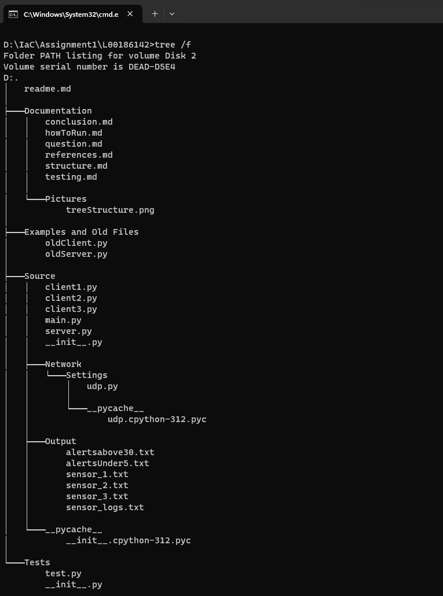

# Folder Structure Description -
- **Documentation Folder**: This highlights the content in the documentation folder.
  - 'Documentation'
    - 'question.md': The question that had been given at the beginning of project.
    - 'howToRun.md': Here is aa step by step of how to run the project between starting the server and client files.
    - 'testing.md': Description of the tests that were carried out and how to run and test them.

- **Examples and Old Files Folder**: Old Files that been modified and added to the Examples folder.
  - 'Examples and Old Files'
    - 'oldServer.py': This code had been given at the beginning of project.
    - 'oldClient.py': This Client python file had been given at the start of project.

- **Tests Folder**: Test file.
  - 'Tests'
    - 'test1.py': This has 2 tests to highlight that the server and client address have correct details.

- **Source Folder**:
  - 'Source'
    - 'Network'
      - 'Settings'
        - 'udp.py': UDP server and client connections.
    - '__init__.py':
    - 'client1.py': sensor 1 and client connections which generates a random temperature and tie delay of 5 seconds.
    - 'client2.py': sensor 2 and client connections which generates a random temperature and tie delay of 10 seconds.
    - 'client3.py': sensor 3 and client connections which generates a random temperature and tie delay of 15 seconds.
    - 'server.py': Server connection and main creator of files in the output folder. Between outputting to over 30 and under 5 degrees then the 3 sensors and printing out to each of them.
- **Output Folder**: The main output folder for saving log and alert files that are text files.
  - 'Output'
    - 'alertsUnder5.txt': stores alerts for temperatures below 5°C.
    - 'alertsAbove30.txt': stores alerts for temperatures above 30°C.
    - 'sensor_logs.txt': general sensor logs.
    - 'sensor_1.txt': logs specific to Sensor ID 1
    - 'sensor_2.txt': logs specific to Sensor ID 2
    - 'sensor_3.txt': logs specific to Sensor ID 3

- **Pictures Folder**: The main picture folder.
  - 'Pictures'
    - 'treeStructure.png': This is the tree structure of folders and files in the project.

# File/ Folder Structure:

